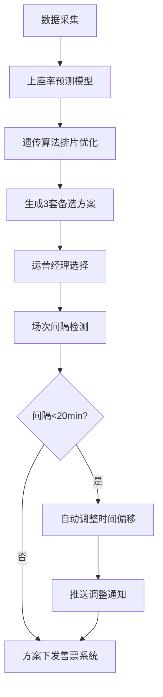
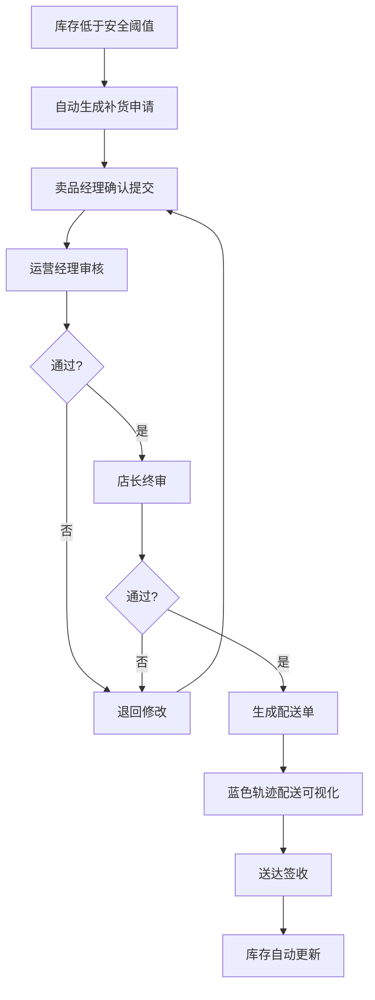
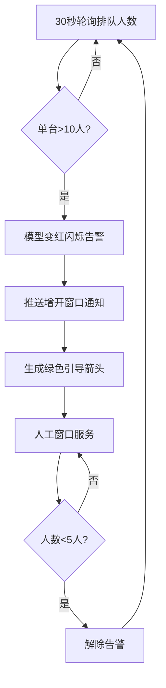

# 城市影院综合体3D交互可视化运营调度与应急管理平台 - 产品需求文档

## 1. 产品概述

面向城市影院综合体的全场景3D交互可视化运营平台，集成影厅调度、卖品管理、客流引导、应急响应等核心功能，通过沉浸式3D场景实现运营数据可视化、智能排片优化与应急决策支持。

- 目标用户：影院运营经理、店长、卖品经理、值班人员、总部运营管理层
- 核心价值：提升影院运营效率30%以上，降低人工调度成本，减少应急响应时间，优化票房收益

---

## 2. 核心功能

### 2.1 用户角色

| 角色 | 登录方式 | 核心权限 |
|------|----------|----------|
| 运营经理 | 账号密码+双因素认证 | 全局3D场景查看、排片方案审批、应急决策、数据报表 |
| 店长 | 账号密码 | 补货申请终审、人员调度、全场景监控、异常处理 |
| 卖品经理 | 账号密码 | 卖品库存管理、补货申请发起、卖品区3D监控 |
| 值班人员 | 账号密码/工号 | 现场操作、事件上报、人工窗口调度、取票机监控 |
| 放映员 | 工号登录 | 放映机房监控、设备状态查看、场次确认 |

### 2.2 功能模块

1. **3D场景主界面**：影院综合体全景3D漫游、区域切换、设备交互、数据叠加
2. **影厅运营模块**：6个影厅实时监控、排片展示、上座率热力、票房曲线、环境监测
3. **智能排片模块**：历史数据分析、节假日预测、24小时上座率预测、最优排片生成、冲突自动调整
4. **售票大厅模块**：自助取票机状态、排队检测、人工窗口调度、客流引导
5. **卖品区模块**：品类库存监控、安全阈值预警、三级电子审批、配送轨迹可视化
6. **VIP休息室模块**：包间使用状态、客户画像、服务呼叫、专属排片推荐
7. **放映机房模块**：放映机状态、氙灯寿命、温度监控、故障告警
8. **总控中心模块**：全局数据大屏、KPI看板、应急预案、事件处置流程

### 2.3 页面详情

| 页面名称 | 模块名称 | 功能描述 |
|----------|----------|----------|
| 3D全景主控台 | 场景漫游 | 鼠标拖拽旋转视角、滚轮缩放、WASD键盘漫游、一键复位 |
| 3D全景主控台 | 区域导航 | 顶部楼层导航条、点击快速跳转对应区域、高亮动画 |
| 3D全景主控台 | 信息叠加层 | 设备悬浮信息卡、数据图标、状态指示灯、告警弹窗 |
| 影厅详情面板 | 基础信息 | 影厅编号/名称/座位数/银幕尺寸/3D/IMAX标识 |
| 影厅详情面板 | 实时监控 | 当前影片海报、开始/结束时间、已售票数/上座率百分比 |
| 影厅详情面板 | 环境监测 | 温度(℃)、湿度(%)、空调运行模式(制冷/制热/通风/故障)、新风PM2.5 |
| 影厅详情面板 | 数据曲线 | 近24小时票房趋势、客流变化、双轴折线图、时间滑块 |
| 影厅详情面板 | 排片热力 | 未来场次时间轴、颜色渐变热度(绿→黄→红)、点击查看场次详情 |
| 智能排片中心 | 预测引擎 | 历史票房回归模型、节假日系数、影片IP热度、竞品分析 |
| 智能排片中心 | 方案生成 | 遗传算法优化排片、厅资源匹配、时长冲突检测、黄金时段优先 |
| 智能排片中心 | 自动调整 | 场次间隔<20min自动检测、时间偏移建议、推送通知至运营经理 |
| 智能排片中心 | 方案对比 | 方案A/B对比、预期票房差异、上座率分布热力图 |
| 售票大厅看板 | 取票机矩阵 | 8台取票机3D模型、运行/故障/离线状态、排队人数气泡 |
| 售票大厅看板 | 排队预警 | 单台排队>10人模型变红、闪烁告警、自动增开人工窗口指令 |
| 售票大厅看板 | 客流引导 | 绿色动态箭头3D路径、从拥堵取票机指向空闲人工窗口 |
| 卖品区管理 | 品类货架 | 爆米花/可乐/热狗/周边等12品类、3D货架模型、库存数字悬浮 |
| 卖品区管理 | 阈值告警 | 低于安全库存货架橙色闪烁、低于危险库存红色报警 |
| 卖品区管理 | 三级审批流 | 卖品经理提交→运营经理审核→店长终审、每级审批意见、电子签名 |
| 卖品区管理 | 配送可视化 | 审批通过后蓝色动态轨迹、配送车3D模型、ETA倒计时、签收确认 |
| VIP休息室 | 包间状态 | 6个VIP包间、使用中/空闲/预定、剩余时长、客户等级标识 |
| VIP休息室 | 服务系统 | 一键呼叫服务、专属菜单、饮品补充提醒、私人影厅预约 |
| 放映机房 | 设备矩阵 | 6台放映机+6台服务器+2台UPS、运行参数实时曲线 |
| 放映机房 | 寿命管理 | 氙灯使用小时数、剩余寿命百分比、更换提醒日历 |
| 放映机房 | 温控系统 | 机柜温度阵列、超温告警联动、空调自动调节 |
| 总控中心 | KPI大屏 | 今日票房/人次/卖品收入/上座率、同比环比、实时刷新 |
| 总控中心 | 应急中心 | 火灾/停电/设备故障/人员冲突预案库、一键启动、处置进度追踪 |
| 总控中心 | 事件日志 | 全量事件时间轴、告警级别颜色、处理人、关闭时间统计 |

---

## 3. 核心流程

### 3.1 智能排片优化流程

每日凌晨2:00系统自动拉取历史数据、影片信息、节假日日历，通过预测模型计算未来24小时各厅上座率分布，运用遗传算法生成3套排片方案，运营经理选择最优方案后系统检查场次间隔，若存在<20分钟间隔自动调整并推送通知，确认后下发至售票系统。

### 3.2 卖品补货三级审批流程

卖品库存低于安全阈值时系统自动生成补货申请单，卖品经理确认数量和供应商后提交，运营经理审核预算和库存周转，店长终审后触发物流配送，配送车沿蓝色轨迹实时显示，送达后扫码签收，库存自动更新。

### 3.3 取票机排队应急流程

系统每30秒轮询各取票机排队人数，当检测到单台排队>10人时3D模型变红闪烁，自动推送增开人工窗口指令至值班人员，3D场景中生成绿色动态箭头引导用户至空闲窗口，排队人数降至5人以下时解除告警。

---

## 4. 用户界面设计

### 4.1 设计风格

- **主色调**：深空蓝(#0A1628) + 科技青(#00D4FF) + 警示橙(#FF8C00) + 告警红(#FF3B5C)
- **辅助色**：数据绿(#00FFA3)、票房金(#FFD700)、VIP紫(#9D4EDD)
- **按钮风格**：圆角8px、渐变边框、悬浮发光效果、点击涟漪动画
- **字体方案**：标题使用 Orbitron(科技感) + 正文使用 PingFang SC(可读性)
- **布局风格**：沉浸式全屏3D场景 + 可折叠侧边数据面板 + 悬浮信息卡片
- **图标风格**：线性描边图标 + 发光效果 + 状态色动态变化

### 4.2 页面设计概览

| 页面/模块 | 设计要点 |
|-----------|----------|
| 3D全景主控台 | 全黑背景+星光粒子、中心3D影院模型、顶部半透明导航栏、左下角迷你地图、右下角快捷操作盘、数据面板从左侧滑入 |
| 影厅详情面板 | 左侧影片海报大图、右侧数据网格、底部双轴折线图、排片时间轴用颜色渐变条、环境数据用仪表盘 |
| 智能排片中心 | 左侧预测曲线、中部排片甘特图(6厅×24小时)、右侧方案对比、冲突场次用红色边框闪烁 |
| 卖品审批流程 | 三级审批卡片纵向排列、当前待审批高亮发光、审批按钮带电子签名画布、进度条显示整体流程 |
| 总控中心大屏 | 4×3数据卡片矩阵、中心世界地图式客流热力、底部滚动事件条、KPI数字滚动动画 |
| 应急处置界面 | 红色警报边框闪烁、预案卡片按优先级排列、处置步骤勾选、倒计时器、多方通话按钮 |

### 4.3 响应式设计

- 桌面端优先：1920×1080及以上分辨率全屏体验
- 平板端：侧边栏改为底部抽屉、3D场景自适应缩放
- 移动端：精简为核心数据看板+告警推送、支持横屏3D浏览
- 触屏优化：增大点击热区≥48px、支持双指缩放3D场景

### 4.4 3D场景指导

- **环境与氛围**：赛博朋克风格夜景、霓虹灯牌、玻璃幕墙反射、体积雾效果、影院内部暖光与外部冷光对比
- **光照设置**：主光源平行光模拟天光、每个区域独立点光源/聚光灯、屏幕自发光材质、指示灯实时闪烁
- **相机设置**：初始透视相机fov=50、默认鸟瞰视角高度30m、支持第一人称漫游模式、自动旋转展示模式
- **构图重点**：6个影厅环形排列、售票大厅居左前景、卖品区居右前景、VIP休息室二楼、放映机房后侧、总控中心顶层玻璃房
- **交互动画**：点击影厅门打开+镜头推入、取票机红警时脉动放大、配送车沿贝塞尔曲线移动+车轮旋转、绿色箭头沿路径流动
- **后期处理**：Bloom泛光(指示灯/屏幕)、SSAO环境光遮蔽、轻微色差、胶片颗粒感、景深效果(焦点区域外模糊)
- **性能预算**：三角面≤50万、Draw Call≤200、实时帧率≥60fps、支持LOD细节分级
