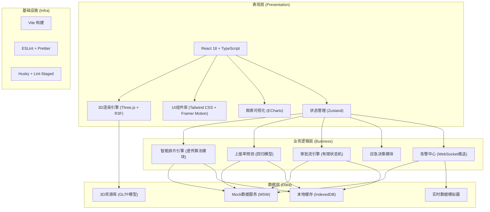

# 城市影院综合体3D交互可视化平台 - 技术架构文档

## 1. 架构设计



---

## 2. 技术栈说明

### 2.1 核心技术选型

| 层级 | 技术方案 | 版本 | 选择理由 |
|------|----------|------|----------|
| 前端框架 | React | 18.x | 函数组件+Hooks、并发模式、生态完善 |
| 开发语言 | TypeScript | 5.x | 类型安全、大型项目可维护性 |
| 构建工具 | Vite | 5.x | 极速HMR、Rollup打包、原生ESM支持 |
| 3D引擎 | Three.js | 0.160.x | WebGL封装、成熟稳定、社区活跃 |
| 3D React封装 | @react-three/fiber | 8.x | 声明式Three.js、React生态融合 |
| 3D组件库 | @react-three/drei | 9.x | 常用3D组件、控制器、后处理封装 |
| 3D后处理 | @react-three/postprocessing | 2.x | Bloom/SSAO/景深等效果 |
| 状态管理 | Zustand | 4.x | 极简API、无Provider嵌套、TS友好 |
| UI样式 | Tailwind CSS | 3.x | 原子化CSS、设计系统、响应式 |
| 动效库 | Framer Motion | 10.x | 声明式动画、手势支持、React原生 |
| 图表库 | ECharts | 5.x | 大数据量性能、双轴图/热力图/甘特图 |
| 路由 | React Router | 6.x | 嵌套路由、懒加载、Data Router |
| Mock服务 | MSW | 2.x | Service Worker拦截、REST/GraphQL模拟 |
| 代码规范 | ESLint + Prettier | 最新 | 统一代码风格、TS类型检查 |

### 2.2 3D关键技术方案

- **场景构建**：程序化生成影院建筑主体 + GLTF加载精细模型(座椅/放映机/取票机)
- **空间数据绑定**：每个3D对象挂载userData关联业务ID，射线检测后查询对应数据
- **LOD分级**：远景简模(5%)、中景中模(30%)、近景精模(100%) + 距离切换
- **实例化渲染**：座椅(InstancedMesh)、灯光广告牌减少Draw Call
- **路径动画**：CatmullRomCurve3 + Flow实现配送车/引导箭头沿路径流动
- **热力可视化**：ShaderMaterial自定义颜色渐变 + vertexColors实现上座率热力

---

## 3. 路由定义

| 路由路径 | 页面组件 | 功能说明 |
|----------|----------|----------|
| `/` | Redirect → `/dashboard` | 根路径重定向至主控台 |
| `/dashboard` | Dashboard3D | 3D全景主控台(默认首页) |
| `/dashboard/hall/:id` | HallDetail | 单个影厅详情+票房曲线 |
| `/scheduling` | SchedulingCenter | 智能排片中心+预测引擎 |
| `/ticketing` | TicketingHall | 售票大厅+取票机监控 |
| `/concession` | ConcessionArea | 卖品区+库存+审批流程 |
| `/vip` | VIPLounge | VIP休息室管理 |
| `/projection` | ProjectionRoom | 放映机房设备监控 |
| `/control` | ControlCenter | 总控中心+KPI+应急 |
| `/emergency` | EmergencyCenter | 应急指挥中心 |
| `/approval` | ApprovalCenter | 统一审批工作台 |

---

## 4. 数据模型与类型定义

```typescript
// 核心业务实体类型

/** 影厅信息 */
interface Hall {
  id: string;
  number: number;
  name: string;
  type: 'STANDARD' | 'IMAX' | 'DOLBY' | 'LUXE';
  totalSeats: number;
  screenSize: { width: number; height: number };
  position: { x: number; y: number; z: number };
}

/** 影厅实时状态 */
interface HallRealtime {
  hallId: string;
  currentMovie: Movie | null;
  currentShowtime: Showtime | null;
  occupiedSeats: number;
  occupancyRate: number;
  temperature: number;
  humidity: number;
  acStatus: 'COOLING' | 'HEATING' | 'VENTILATION' | 'OFF' | 'FAULT';
  pm25: number;
}

/** 场次信息 */
interface Showtime {
  id: string;
  hallId: string;
  movieId: string;
  startTime: Date;
  endTime: Date;
  soldSeats: number;
  predictedOccupancy: number;
  heatLevel: 1 | 2 | 3 | 4 | 5;
}

/** 票房与客流数据点 */
interface BoxOfficeDataPoint {
  timestamp: Date;
  boxOffice: number;
  footfall: number;
  hallId?: string;
}

/** 卖品SKU */
interface ConcessionItem {
  sku: string;
  name: string;
  category: 'SNACK' | 'BEVERAGE' | 'MEAL' | 'MERCHANDISE';
  currentStock: number;
  safetyStock: number;
  dangerStock: number;
  unitPrice: number;
  shelfPosition: { row: number; col: number };
}

/** 补货申请单 */
interface RestockOrder {
  id: string;
  items: { sku: string; quantity: number; unitPrice: number }[];
  totalAmount: number;
  status: 'DRAFT' | 'MANAGER_PENDING' | 'OPERATIONS_PENDING' | 'STORE_PENDING' | 'APPROVED' | 'REJECTED' | 'DELIVERING' | 'COMPLETED';
  applicantId: string;
  approvals: { level: 1 | 2 | 3; approverId: string; comment: string; signedAt: Date }[];
  delivery: {
    carrier: string;
    eta: Date;
    path: { x: number; y: number; z: number }[];
    status: 'PENDING' | 'IN_TRANSIT' | 'DELIVERED';
  } | null;
  createdAt: Date;
}

/** 自助取票机 */
interface TicketMachine {
  id: string;
  status: 'ONLINE' | 'OFFLINE' | 'FAULT';
  queueLength: number;
  paperRemaining: number;
  position: { x: number; y: number; z: number };
}

/** 告警事件 */
interface AlertEvent {
  id: string;
  type: 'QUEUE' | 'STOCK' | 'DEVICE' | 'EMERGENCY' | 'SCHEDULE';
  level: 'INFO' | 'WARNING' | 'CRITICAL';
  title: string;
  description: string;
  location3d: { x: number; y: number; z: number };
  status: 'NEW' | 'ACKNOWLEDGED' | 'PROCESSING' | 'RESOLVED';
  createdAt: Date;
  handlerId?: string;
}
```

---

## 5. 状态管理设计 (Zustand Store)

```typescript
// stores/useTheaterStore.ts 核心状态切片
interface TheaterState {
  // 3D场景状态
  cameraMode: 'ORBIT' | 'FIRST_PERSON' | 'AUTO_ROTATE';
  focusArea: AreaType | null;
  selectedObjectId: string | null;
  
  // 业务数据
  halls: Hall[];
  hallRealtimeMap: Record<string, HallRealtime>;
  showtimes: Showtime[];
  concessionItems: ConcessionItem[];
  ticketMachines: TicketMachine[];
  restockOrders: RestockOrder[];
  alerts: AlertEvent[];
  
  // 数据操作
  fetchInitialData: () => Promise<void>;
  startRealtimeSimulation: () => void;
  stopRealtimeSimulation: () => void;
  
  // 交互操作
  setFocusArea: (area: AreaType | null) => void;
  selectObject: (id: string | null) => void;
  acknowledgeAlert: (alertId: string, handlerId: string) => void;
  approveRestock: (orderId: string, level: 1|2|3, approverId: string, comment: string) => void;
}
```

---

## 6. 3D场景组件结构

```
src/components/3d/
├── TheaterScene.tsx          # 场景根组件
├── TheaterBuilding.tsx       # 影院建筑主体(程序化建模)
├── HallRow.tsx               # 影厅区域组件
├── HallUnit.tsx              # 单个影厅单元(含门/屏幕/座椅/指示灯)
├── TicketingLobby.tsx        # 售票大厅+取票机阵列
├── ConcessionStand.tsx       # 卖品区+货架模型
├── VIPLounge.tsx             # VIP休息区
├── ProjectionRoom.tsx        # 放映机房
├── ControlCenter.tsx         # 总控中心顶层
├── DeliveryVan.tsx           # 配送车(路径动画)
├── GuideArrow.tsx            # 客流引导箭头(流动材质)
├── InfoCard3D.tsx            # 3D悬浮信息卡
├── AlertMarker.tsx           # 告警标记(脉动发光)
├── cameras/
│   ├── OrbitCameraRig.tsx
│   ├── FirstPersonRig.tsx
│   └── AutoTourCamera.tsx
├── effects/
│   ├── HeatmapMaterial.ts
│   ├── FlowPathMaterial.ts
│   └── PulseGlowMaterial.ts
└── lighting/
    ├── TheaterLighting.tsx
    └── NeonSigns.tsx
```

---

## 7. 关键算法实现要点

### 7.1 智能排片遗传算法
- 染色体编码：`[hallId, movieId, startTime]` 基因序列
- 适应度函数：`Σ(票房预测×上座率系数) - λ×场次冲突惩罚 - μ×间隔不足惩罚`
- 选择算子：锦标赛选择(Tournament Selection)
- 交叉算子：两点交叉 + 厅内时间冲突修复
- 变异算子：随机时间偏移 ±30分钟、随机换片
- 收敛条件：迭代500代或适应度变化率<1e-4

### 7.2 上座率预测模型
- 特征工程：`[历史7天上座率均值, 星期编码, 节假日flag, 影片热度分, 票价, 厅类型]`
- 模型：Gradient Boosting Regression (lightgbm纯JS实现/简化版)
- 在线学习：每日收盘增量训练，权重衰减系数0.95

### 7.3 三维空间射线拾取
- 事件委托：根组件统一监听pointerdown，复用Raycaster
- 多层级拾取：GROUP → MESH递归查找最近的业务对象
- 拾取防抖：100ms节流避免频繁触发

---

## 8. 目录结构

```
553/
├── .trae/documents/                    # 文档目录
├── public/
│   ├── models/                         # GLTF 3D模型资源
│   ├── textures/                       # 纹理贴图
│   └── icons/                          # 图标资源
├── src/
│   ├── assets/                         # 静态资源
│   ├── components/
│   │   ├── 3d/                         # 3D场景组件(见§6)
│   │   ├── ui/                         # 2D UI组件(卡片/按钮/表单)
│   │   ├── charts/                     # ECharts图表封装
│   │   ├── panels/                     # 侧边数据面板
│   │   └── modals/                     # 弹窗组件
│   ├── pages/                          # 路由页面组件
│   ├── stores/                         # Zustand状态管理
│   ├── hooks/                          # 自定义Hooks
│   │   ├── use3DPicker.ts
│   │   ├── useRealtimeSimulation.ts
│   │   └── useAlertCenter.ts
│   ├── algorithms/                     # 核心算法
│   │   ├── scheduling/ga.ts
│   │   └── prediction/occupancy.ts
│   ├── services/                       # API服务层
│   │   ├── mock/                       # MSW Mock handlers
│   │   ├── hallService.ts
│   │   └── concessionService.ts
│   ├── types/                          # TS类型定义
│   ├── utils/                          # 工具函数
│   ├── constants/                      # 常量配置
│   ├── styles/                         # 全局样式
│   ├── App.tsx
│   ├── main.tsx
│   └── router.tsx
├── index.html
├── vite.config.ts
├── tsconfig.json
├── tailwind.config.js
├── postcss.config.js
├── eslint.config.js
└── package.json
```

---

## 9. 性能优化策略

| 优化点 | 方案 | 预期效果 |
|--------|------|----------|
| 3D渲染性能 | LOD + InstancedMesh + 视锥剔除 + 材质合并 | Draw Call减少60% |
| 大列表渲染 | 虚拟化列表(react-window) + 分页加载 | 首屏渲染<2s |
| 图表性能 | ECharts增量更新 + Canvas渲染 + 数据采样 | 1万点数据<100ms |
| 状态更新 | Zustand selectors避免无关重渲染 + useMemo | 组件重渲染减少40% |
| 资源加载 | GLTF Draco压缩 + 纹理KTX2转码 + 预加载 | 模型加载减少70%体积 |
| 首屏体验 | 路由懒加载 + 骨架屏 + 渐进式3D加载 | FCP<1s, LCP<3s |
